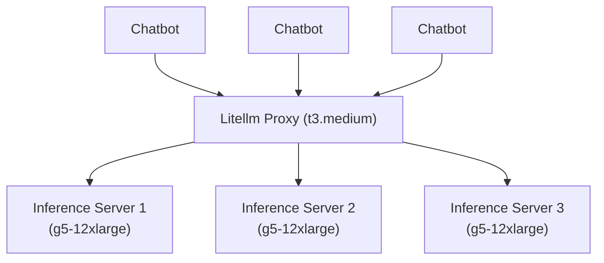

# Infrastructure Plan

## Architecture Diagram



## Components

1. **Litellm Proxy**:
   - Acts as a load balancer for g5-12xlarge Inference Servers.
   - Configured to distribute requests evenly across EC2-12xlarge Inference Servers.
   - 1 EC2 t3.medium instance for running the Litellm Proxy.

2. **EC2-12xlarge Inference Servers**:
   - Each instance runs inference services for LLM models.
   - 3 EC2-12xlarge instances for running inference.

3. **k6 Load Testing**:
   - Uses `common.js` and `long.js` scripts for load testing.
   - Sends metrics to Kibana for visualization.

4. **Kibana Visualization**:
   - Visualizes the load testing results.
   - Provides dashboards and metrics for monitoring.

## Configuration

### Litellm Proxy

- **Docker Compose Configuration**:
  - Update `docker-compose.litellm.yaml` to ensure Litellm is configured as the gateway.
  - Ensure the Litellm service is properly configured to load balance requests to the EC2-12xlarge Inference Servers.

### EC2-12xlarge Inference Servers

- **Docker Compose Configuration**:
  - Update `docker-compose.yml` to ensure the inference servers are configured correctly.
  - Ensure the inference service is properly configured to run on the EC2-12xlarge instances.

### k6 Load Testing

- **Scripts**:
  - Review and modify `common.js` and `long.js` as necessary.
  - Ensure the scripts are configured to send metrics to Kibana.

### Kibana Visualization

- **Dashboards**:
  - Create Kibana dashboards to visualize the load testing results.
  - Define specific metrics and visualizations based on the user's requirements.

## Steps

- Launch the required EC2 instances.
- Configure the networking settings.
- Configure `config.yaml` to load balance according to available network settings.
- Test setup using k6
  ```sh
  MODEL_ID="Qwen/Qwen2.5-Coder-32B-Instruct-AWQ" HOST=localhost:8080 k6 run --duration=600 long.js
  MODEL_ID="Qwen/Qwen2.5-Coder-32B-Instruct-AWQ" HOST=localhost:8080 k6 run --duration=600 common.js
  ```
- Setup Kibana and Integrate with k6 for visualization