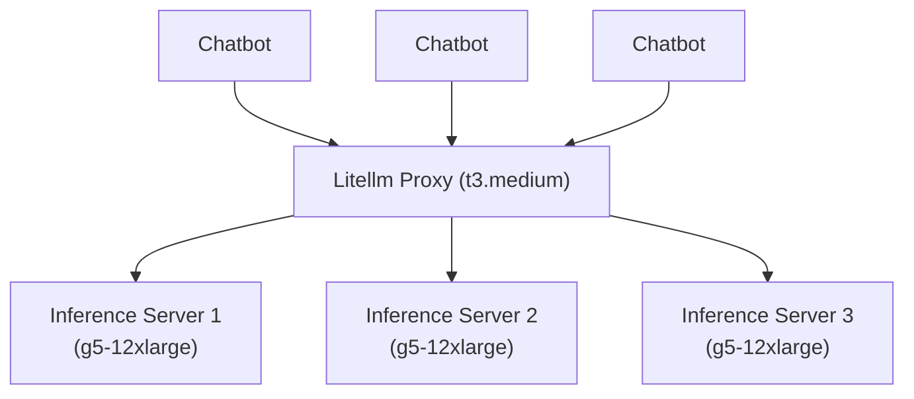

# Infrastructure Plan

## Architecture Diagram

## Components

1. **Litellm Proxy**:
   - Acts as a load balancer for g5-12xlarge Inference Servers.
   - Configured to distribute requests evenly across EC2-12xlarge Inference Servers.
   - 1 EC2 t3.medium instance for running the Litellm Proxy.

2. **EC2-12xlarge Inference Servers**:
   - Each instance runs inference services for LLM models.
   - 3 EC2-12xlarge instances for running inference.

3. **AnythingLLM for Chatbot UI**:
   - Chatbot with various tool calling support
   - Easy and fast.

## Configuration

### Litellm Proxy

- **Docker Compose Configuration**:
  - Update `docker-compose.litellm.yaml` to ensure Litellm is configured as the gateway.
  - Ensure the Litellm service is properly configured to load balance requests to the EC2-12xlarge Inference Servers.

### EC2-12xlarge Inference Servers

- **Docker Compose Configuration**:
  - Update `docker-compose.yml` to ensure the inference servers are configured correctly.
  - Ensure the inference service is properly configured to run on the EC2-12xlarge instances.